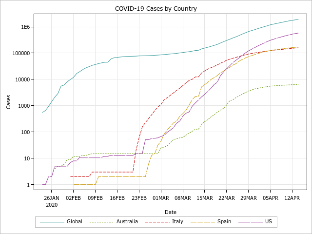

# COVID-19 Analysis

Using the John Hopkins Git repository timeseries data in combination with World Programming (WPS Analytics, SAS engine) [WPS](https://www.worldprogramming.com/).

  
Logarithmic axis.

Fit a basic exponential model to the global data since 20 March 2020 and extrapolate.

  
Logarithmic axis.
